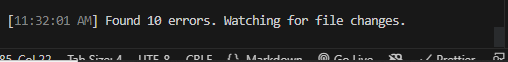
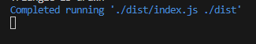

# Environment Setup For TypeScript Development Crash Course🚀🚀
* Overview
  - [Introduction](#introduction)
  - [Setting up the Environment](#setting-up-the-environment)
  - [The tsconfig file](#the-tsconfig-file)
  - [The package.json file](#the-packagejson-file)
  - [Starting the environment](#starting-the-environment)
  - [Conclusion](#conclusion)

## Introduction
In the ever-evolving landscape of Software development, staying at the forefront of technology is paramount. As such TypeScript, a statically-typed superset of JavaScript, has emerged as a powerful tool to enhance the development process, providing developers with cool modern language features. If you are ready to embark on a journey into the world of development with TypeScript, you've come to the right place!💪💪

In this comprehensive guide, we will walk through the essential steps of setting up a development environment for TypeScript, ensuring you're equipped with the right setup to dive headfirst into this exciting realm of programming.

Whether you're a seasoned JavaScript developer looking to add TypeScript to your skill set or a newbie to web development, this course will provide you with all you need to get started with TypeScript. We'll cover everything from installing TypeScript and configuring your development environment.

So, fasten your seatbelts, as we embark on a journey to supercharge your software development skills with TypeScript! Let's get started. 🚀🚀


## Setting up the Environment
* npm init -y
* add the following to package.json: "type":"module"
* Install typescript as dev dependency with the command: `npm install typescript --save-dev`
* Add the following to the `"scripts"` property in package.json: `"build": "tsc --watch", "dev":"node ./dist/index.js --watch ./dist"`
* Create an "src" directory in the root of the folder. This is where all your ".ts" files and other folders related to typescript will go. 
* Install the following by typing the following in the root directory's command line: `npm i -D @types/node`.
* next type `npm install --save-dev ts-node` to install ts-node as dev dependency.
* Create a tsconfig.json file. You could type this command `npx tsc --init` Or create a concise tsconfig.json file like the one below.
## The tsconfig file
**Your tsconfig.json file should look like the following**
```json
{
	"compilerOptions":{
		"module":"NodeNext",
		"moduleResolution": "NodeNext",
		"target": "ES2020", // Could be any ES<Year> but shouldn't exceed current year
		"sourceMap": true,
		"outDir": "dist" 
	},
	"include":["src/**/*"]
}
```
### Code Explanation:
* **`"compilerOptions"`**: Specifies various compiler options that affect how TypeScript compiles the code.
  * `"module": "NodeNext"`: Specifies the module system to use. In this case, it's set to `"NodeNext"`.
  * `"moduleResolution": "NodeNext"`: Specifies the module resolution strategy. Similar to the `module` option, this is set to `"NodeNext"`.
  * `"target": "ES2020"`: This part specifies the version of ECMAScript that the TypeScript code should target. In our case, it is targeting ES2020, which means that the generated JavaScript code will be compatible with ECMAScript 2020 features.
  * `"sourceMap": true`: Generates source map files alongside the compiled JavaScript. ".map" files allows us to debug the TypeScript code in the original TypeScript source files, even after they have been compiled to JavaScript.
  * `"outDir": "dist"`: This part Specifies the folder where the compiled JavaScript files should be output. In this case the compiled files will be placed in a folder called "dist".
  * `include`: This part specifies which files should be included in the TypeScript compilation. Our configuration makes `include` include all files within the "src" directory and its subdirectories that match the pattern "src/**/*". This means TypeScript will compile all TypeScript files found in the "src" directory and its subdirectories.
## The package.json file
**Your package.json file should look like the following**
```json
{
  "name": "typescripttutorial",
  "version": "1.0.0",
  "description": "",
  "main": "index.js",
  "type": "module",
  "scripts": {
    "test": "echo \"Error: no test specified\" && exit 1",
    "build": "tsc --watch",
    "dev": "nodemon --watch ./dist/index.js ./dist"
  },
  "keywords": [],
  "author": "",
  "license": "ISC",
  "devDependencies": {
    "@types/node": "^20.5.7",
    "ts-node": "^10.9.1",
    "typescript": "^5.2.2"
  },
  "dependencies": {
    "nodemon": "^3.0.1"
  }
}
```

## Starting the environment
TypeScript is a compiled language as such we need to compile our source code to javascript first before we can see the result in nodejs CLI.
To do this we open two terminals and in one we do a `npm run build` and in the other we do a `npm run dev`.

If you followed the method very well, you should see something like this in the `npm run build` terminal

 

and this in the `npm run dev` terminal

 

Now create an `index.ts` file in the `src` folder and type `console.log("Hello World")`. You'll see it compile and show "Hello World" in the `npm run dev` command line.

## Conclusion

🎉 Congratulations! You've completed this whirlwind tour of TypeScript environment setup. You armed with the right TypeScript environment. 🚀 Remember, practice and exploration are your best allies in software development. Stay curious and keep coding 💻🌟.
